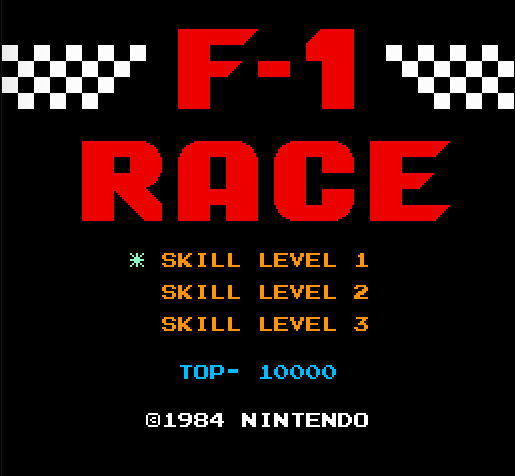
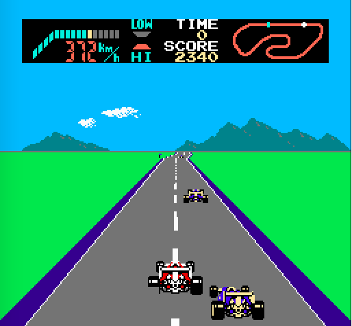

# AI-Race

## Exploring for how to use AI to play the Nintendo's(NES) classic game F1 race.

Although the project is under working, you can collect data using these scripts and train a CNN model to play the game.

These scripts were build on Mac but hope they will work on Windows and Linux too.

I used OpenEmu to emulate the game on Mac, but, you can try it in you browser too here `http://www.nintendoemulator.com/nes/4099`.

For testing the gameplay i did used the browser as OpenEmu didn't allowed keyboard inputs from the script for gameplay.

### [grabScreen.py](grabScreen.py)

Using this you can take screenshots of your screen with sync to your keyboard keys pressed simultaneously. Change `monitor` in the file to specify the screen capture area.

### [prepare_data.py](prepare_data.py)

The data captured is now processed and the labels are converted into one-hot encoding. The images are cropped appropriately and resized and saved.

### [models.py](models.py)

Contains different CNN models to try for training.

### [train.py](train.py)

The training of the model is done here. The code is self explanatory.

### [play.py](play.py)

Script for the model to play the game.
